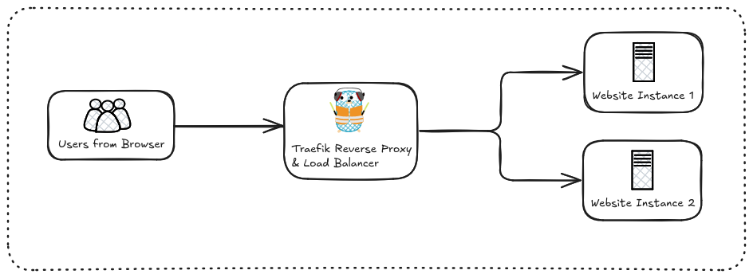

# Static Website with Traefik Load Balancer

<!-- ## Project Overview -->
## Feature

This project demonstrates how to host a website accross multiple containers/servers and balance traffic between them using **[Traefik](https://doc.traefik.io/traefik/)**, a modern HTTP reverse proxy and load balancer.

It is ideal for beginners who want to understand how load balancing works in a **Dockerized environment**.

NB: In this project, `website1` and `website2` are the same, but just for visualisation purpose, I changed a small part of the source code to help user to easily identify which container serve the version of the website displayed in the browser.

### How to Run